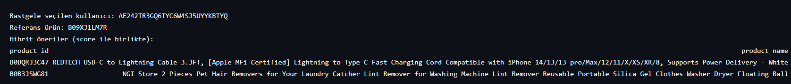

# Amazon-Product-Recommendation-System
This project implements a hybrid product recommendation system for Amazon-like datasets. The system combines Content-based Filtering (CB), Collaborative Filtering (CF), and Neural Collaborative Filtering (NCF) methods to generate personalized product recommendations.

### Key Features 🚀
1.Content-based Filtering (CB): Recommends similar products based on product descriptions and categories.

2.Collaborative Filtering (CF): Uses user-item interactions to recommend products based on similar users.

3.Neural Collaborative Filtering (NCF): Uses a deep learning model to capture complex user-item interactions and improve recommendations.

4.Hybrid Scoring: Combines CB, NCF, and normalized product scores (ratings) using weighted averaging to create a final score.

---
### Installation ⚙️
-Create a Python environment.

--Install the necessary libraries:
```bash
pip install torch pandas scikit-learn tensorflow
```


Place a dataset named amazon.csv in the data/ folder, containing at least the following columns:

Place your dataset `amazon.csv` in the `data/` folder:

| user_id | product_id | rating | text                  | category             |
|---------|------------|--------|----------------------|--------------------|
| U123    | P001       | 4.5    | "Product description..." | Category/Subcategory |


### Data Preparation 📝
1.User-Item Matrix: Constructed from the user_id, product_id, and rating columns.

2.Product DataFrame: Includes metadata such as product name, category, description, and average rating.

3.Normalization: Ratings and NCF scores are normalized to the [0,1] range so they can be combined with CB scores.

### Usage 🚀
Run the main.py file to start the recommendation pipeline.
```bash
from data_preprocessing import load_and_prepare
from content_based import ContentModel
from collaborative import CFModel
from neural_cf import train_ncf, ncf_predict_user
from hybrid import generate_candidates, score_and_rerank

# Load data
train_df, test_df, df_products, user_item_matrix = load_and_prepare('data/amazon.csv')

# Train CB model
content = ContentModel()
content.fit(df_products, text_col='text')

# Train CF model
cf = CFModel(n_components=20)
cf.fit(user_item_matrix)

# Train NCF model
ncf_model, inv_user_map, inv_item_map = train_ncf(train_df, epochs=10)

# Generate hybrid recommendations
user_id = "EXAMPLE_USER"
candidates = generate_candidates(
    user_id, 
    df_products, 
    train_df.groupby('user_id')['product_id'].apply(list).to_dict(), 
    top_k=100
)

recommendations = score_and_rerank(
    candidates, 
    df_products, 
    content_model=content, 
    target_product_id=None, 
    ncf_df=None, 
    top_n=10
)

print(recommendations)
```
### Hybrid Recommendation Pipeline 🔧
-Candidate Generation: The pool of candidates is created by combining products the user previously interacted with and popular items.

-Scoring: Each candidate product receives three different scores:
```bash
cb_score (Content-based similarity)

ncf_score (NCF model prediction)

rating_score (Normalized average rating)
```

Weighted Combination: These scores are combined using predefined weights to calculate the final score.
```bash
Final Score = (0.4 * cb_score) + (0.3 * ncf_score) + (0.3 * rating_score)
```

Top-N Selection: The top N products, ranked by the final score, are presented as recommendations.

### Customization 🛠️
-You can adjust the influence of CB, NCF, and rating scores by changing the weights in the score_and_rerank function.

-Control the size of the candidate pool (top_k) and the final recommendation list (top_n).

-You can increase the NCF model size or the number of training epochs (epochs) for better performance.

Output Example 📈



